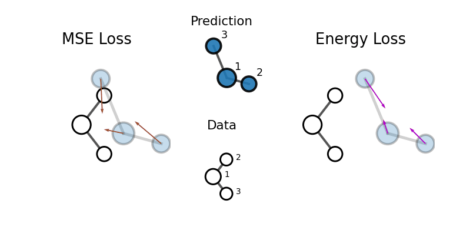
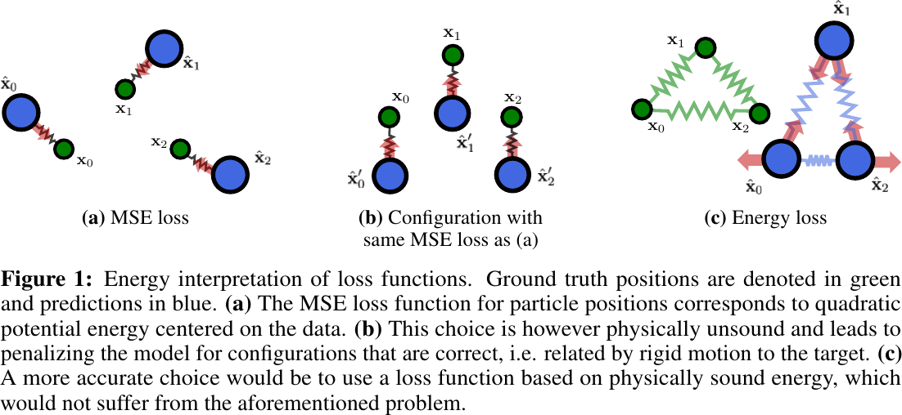
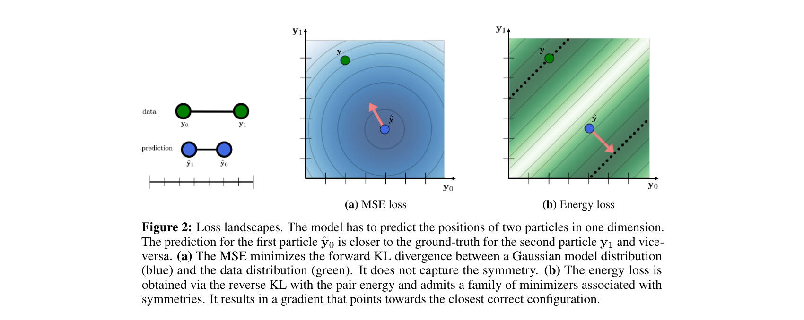
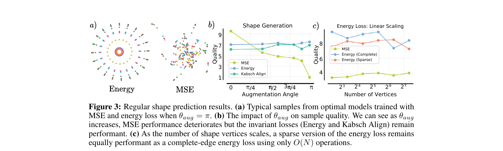
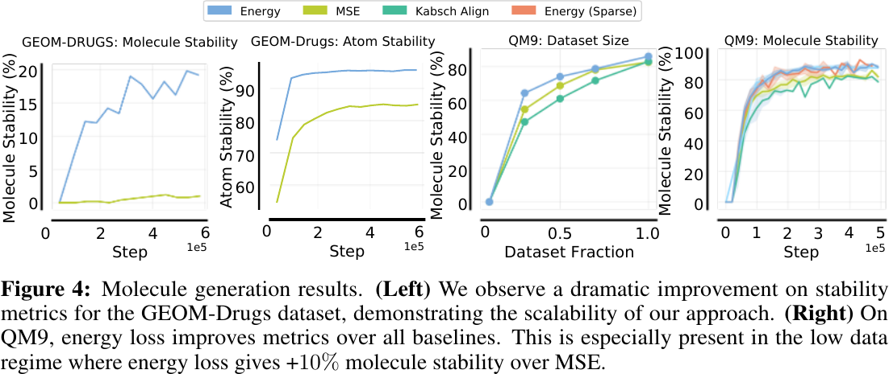

# Energy Loss Functions for Physical Systems

**NeurIPS 2025** &nbsp;|&nbsp; [Paper (arXiv:2511.02087)](https://arxiv.org/abs/2511.02087)

**Sékou-Oumar Kaba\*, Kusha Sareen\*, Daniel Levy, Siamak Ravanbakhsh**
McGill University & Mila – Quebec Artificial Intelligence Institute

---

<p align="center">
  
</p>

## Overview

We propose a framework to leverage physical information directly into the **loss function** for prediction and generative modeling tasks on systems like molecules and spins. We derive *energy loss functions* by assuming each data sample is in thermal equilibrium with respect to an approximate energy landscape and minimizing the reverse KL divergence to a Boltzmann distribution centered on the data.

The resulting energy loss functions:
- Are **SE(3)-invariant by construction** — no alignment procedure required
- Yield **gradients that better reflect physically valid configurations**
- Are **architecture-agnostic and computationally efficient**
- Can be used as a **drop-in replacement** for MSE in diffusion models and regression tasks

<p align="center">
  
</p>

## Method

### Energy Loss for Atomistic Systems

For a system of *n* atoms with positions **y** ∈ ℝⁿˣᵈ, the energy loss is:

$$E(\hat{\mathbf{y}}, \mathbf{y}) = \sum_{i,j} \frac{1}{2} k_{ij}(\mathbf{y}) \Big( \|\mathbf{y}_i - \mathbf{y}_j\| - \|\hat{\mathbf{y}}_i - \hat{\mathbf{y}}_j\| \Big)^2$$

where *k*ᵢⱼ(**y**) are distance-dependent spring coefficients. The loss penalizes errors in pairwise distances between the prediction **ŷ** and the ground truth **y**, making it invariant to rigid motions.

<p align="center">
  
</p>

### Supported Coefficient Modes

| Mode | Description |
|------|-------------|
| `constant` | Uniform spring constants |
| `exp_dist` | Exponential decay with distance (best for molecules) |
| `inv_dist` | Inverse distance |
| `inv_dist2` | Inverse squared distance |
| `lj` | Lennard-Jones inspired, bond-aware |

### Supported Edge Modes

| Mode | Description |
|------|-------------|
| `complete` | All pairwise interactions — O(N²) |
| `k_regular` | Sparse rigid graphs — O(N) with same global optima |
| `bonds` | Molecular bond graph |

## Repository Structure

```
energy_loss/
├── shape_generation/       # Experiment 1: Regular polygon prediction
│   ├── main.py             # Training entry point
│   ├── losses.py           # Energy loss and all baselines
│   ├── models_noise_schedule.py  # Diffusion model + MLP denoiser
│   ├── datasets.py         # Polygon dataset generation
│   ├── regression.py       # Regression variant
│   └── kabsch.py           # Kabsch alignment (FAPE baseline)
│
├── e3_diffusion_for_molecules/   # Experiment 2: EDM + energy loss (QM9 / GEOM-Drugs)
│   ├── equivariant_diffusion/
│   │   └── en_diffusion.py # Energy loss integrated into EDM
│   ├── main_qm9.py         # QM9 training entry point
│   ├── main_geom_drugs.py  # GEOM-Drugs training entry point
│   └── best_hyperparams.yaml
│
├── JODO/                   # Experiment 3: JODO + energy loss (QM9 / GEOM-Drugs)
│   ├── energy_loss.py      # Energy loss module
│   ├── losses.py           # Loss functions with energy loss integration
│   ├── main.py             # Training entry point
│   └── configs/            # YAML configs for all datasets
│
├── assets/                 # Paper figures
├── paper.pdf               # Full paper
└── requirements.txt
```

## Installation

```bash
# Core dependencies
pip install torch torchvision torch_geometric
pip install rdkit wandb hydra-core omegaconf

# For molecule generation experiments
pip install -r requirements.txt

# For JODO specifically
pip install -r JODO/req.txt
```

## Experiments

### 1. Regular Shape Prediction

A controlled experiment where a model predicts the vertices of a regular polygon of a given radius. Tests robustness to rotational augmentation.

```bash
cd shape_generation

# Energy loss (best overall)
python main.py --loss_mode energy --coeff_mode exp_dist --num_vertices 20

# MSE baseline
python main.py --loss_mode mse --num_vertices 20

# Kabsch-aligned MSE (FAPE)
python main.py --loss_mode fape --num_vertices 20

# Sparse energy loss (linear scaling)
python main.py --loss_mode energy_sparse --edge_mode k_regular --num_vertices 20

# With rotation augmentation (energy loss is robust, MSE degrades)
python main.py --loss_mode energy --coeff_mode exp_dist --aug_angle -1
python main.py --loss_mode mse --aug_angle -1
```

**Key results:** Energy loss maintains high quality under full rotation augmentation (θ_aug = π) while MSE performance degrades dramatically. Sparse energy loss using rigid graphs scales as O(N) with the same global optima.

<p align="center">
  
</p>

---

### 2. Molecule Generation with EDM (QM9 / GEOM-Drugs)

Energy loss integrated into [E(3) Equivariant Diffusion Models (EDM)](https://github.com/ehoogeboom/e3_diffusion_for_molecules).

```bash
cd e3_diffusion_for_molecules

# QM9 — energy loss
python main_qm9.py --exp_name qm9_energy --loss_mode energy \
  --energy_coeff_mode exp_dist --diffusion_steps 500 --n_epochs 200

# QM9 — MSE baseline
python main_qm9.py --exp_name qm9_mse --loss_mode l2 \
  --diffusion_steps 500 --n_epochs 200

# GEOM-Drugs — energy loss
python main_geom_drugs.py --exp_name geom_energy --loss_mode energy \
  --energy_coeff_mode exp_dist
```

Best hyperparameters (from `best_hyperparams.yaml`):

| Model | Loss | Coeff | LR |
|-------|------|-------|----|
| GNN | energy | exp_dist | 4.5e-4 |
| EGNN | energy | exp_dist | 1.3e-4 |
| GNN | mse | — | 1e-3 |
| EGNN | mse | — | 3e-4 |

---

### 3. Molecule Generation with JODO (QM9 / GEOM-Drugs)

Energy loss integrated into [JODO](https://github.com/GRAPH-0/JODO), a joint 2D & 3D diffusion model for complete molecule generation.

```bash
cd JODO

# QM9 — energy loss
python main.py --config configs/vpsde_qm9_uncond_jodo.py --mode train \
  --workdir exp_uncond/vpsde_qm9_energy \
  --config.training.use_energy_loss True

# QM9 — MSE baseline
python main.py --config configs/vpsde_qm9_uncond_jodo.py --mode train \
  --workdir exp_uncond/vpsde_qm9_mse

# GEOM-Drugs — energy loss
python main.py --config configs/vpsde_geom_uncond_jodo.py --mode train \
  --workdir exp_uncond/vpsde_geom_energy \
  --config.training.use_energy_loss True
```

See `JODO/README.md` for the full set of training, sampling, and evaluation commands.

---

## Results

### Molecule Generation

<p align="center">
  
</p>

Energy loss yields faster convergence and better stability metrics across all settings. On QM9 with non-equivariant GDM, energy loss gives **+6% molecule stability** over MSE. It is also significantly more **data-efficient**: energy loss matches the MSE optimum using only 50% of the training data.

**Table: QM9 with GDM-aug**

| Loss | Mol. Stab. (%) | Atom Stab. (%) | Validity (%) |
|------|:-:|:-:|:-:|
| MSE | 83.7 ± 2.3 | 98.3 ± 0.004 | 93.6 ± 1.7 |
| Kabsch align | 82.3 ± 0.5 | 97.8 ± 0.004 | 90.8 ± 2.0 |
| **Energy** | **89.8 ± 2.8** | **99.3 ± 0.3** | **97.7 ± 1.4** |
| Energy (sparse) | 89.1 ± 0.9 | 99.0 ± 0.1 | 97.4 ± 2.5 |

## Citation

```bibtex
@inproceedings{kaba2025energy,
  title={Energy Loss Functions for Physical Systems},
  author={Kaba, S{\'e}kou-Oumar and Sareen, Kusha and Levy, Daniel and Ravanbakhsh, Siamak},
  booktitle={Advances in Neural Information Processing Systems},
  year={2025}
}
```

This codebase builds on [EDM](https://github.com/ehoogeboom/e3_diffusion_for_molecules) and [JODO](https://github.com/GRAPH-0/JODO). Please also cite the original works if you use those components.
